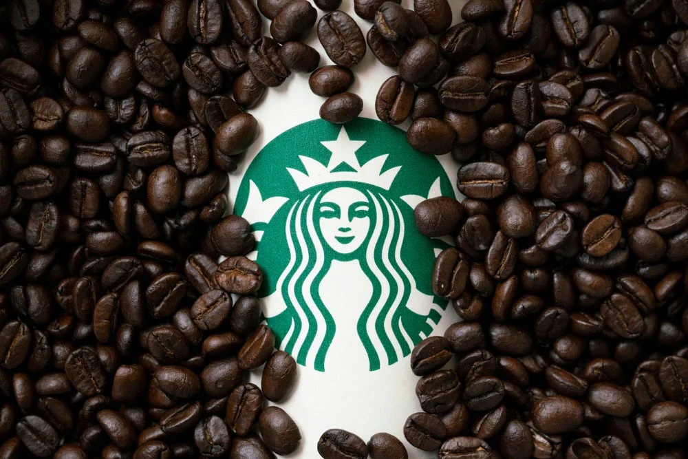

# Starbucks Analysis Project
- This project is a part of Udacity Data Science Nanodegree.
- My Medium blogspot: [Data Scientist Nanodegree Capstone — Starbucks Project](https://medium.com/@phat.caominh.dev/understanding-starbuck-customer-behavior-through-offer-response-modeling-and-analysis-6c6bb9f5a8ff)

## Table of content
1. [Project Overview](https://github.com/Phatcm/Starbucks-Analysis-Project?tab=readme-ov-file#1-project-overview)
2. [Project Components](https://github.com/Phatcm/Starbucks-Analysis-Project?tab=readme-ov-file#2-project-components)
3. [Installation](https://github.com/Phatcm/Starbucks-Analysis-Project?tab=readme-ov-file#3-installation)
4. [File Descriptions](https://github.com/Phatcm/Starbucks-Analysis-Project?tab=readme-ov-file#4-file-descriptions)
5. [Instructions](https://github.com/Phatcm/Starbucks-Analysis-Project?tab=readme-ov-file#5-instructions)
6. [Credits and Acknowledgements](https://github.com/Phatcm/Starbucks-Analysis-Project?tab=readme-ov-file#6-credits-and-acknowledgements)

## 1. Project Overview
The dataset represents customer interaction with Starbucks offers in a simulated rewards mobile app. Offers vary, ranging from promotional ads to incentives like discounts or "buy one, get one" deals. The project aims to explore how different demographic groups respond to these offers, combining demographic, transaction, and offer data to determine effective targeting strategies.  

## 2. Project Components
The project is structured as follows:
- Data Preparation:
    - Read and clean datasets.
    - Summarize data features.
    - Combine relevant data into a single cleaned dataset.
- Data Exploration:
    - Conduct exploratory data analysis (EDA).
    - Visualize key data insights.
- Model Building:
    - Split data into training and testing sets and scale features.
    - Train and evaluate machine learning models.
    - Optimize the best-performing model using hyperparameter tuning.
    - Analyze feature importance and model performance.
  
## 3. Installation
- Python (version 3) and Jupyter Notebook
- Libraries:
    - Data Processing: Pandas, NumPy
    - Visualization: Matplotlib, Seaborn, Plotly
    - Machine Learning: SciPy, Scikit-Learn, XGBoost

## 4. File Descriptions
- Data Folder:
    - data.csv: The final dataset combining all data sources.
    - portfolio.json: Offer details.
    - profile.json: Customer demographics.
    - transcript.json: Customer transactions and offer interactions.
- Jupyter Notebooks:
    - 1_Preprocessing.ipynb: Contains data cleaning and merging steps.
    - 2_Data_Exploration.ipynb: Covers data exploration and visualization.
    - 3_Data_Modeling.ipynb: Handles model building and evaluation.

### Dataset Schema:
- portfolio.json:
    - id: Offer identifier.
    - offer_type: Offer type (e.g., discount, informational).
    - difficulty: Minimum spend required.
    - reward: Reward amount.
    - duration: Offer duration in days.
    - channels: Communication channels used.

- profile.json:
    - age: Customer age.
    - became_member_on: Membership creation date.
    - gender: Gender.
    - id: Customer ID.
    - income: Annual income.

- transcript.json:
    - event: Type of interaction (transaction, offer viewed, etc.).
    - person: Customer ID.
    - time: Time since the test start.
    - value: Offer ID or transaction amount.

## 5. Instructions
Each notebook file corresponds to a project phase (preprocessing, exploration, modeling). Ensure all JSON files and the final data.csv file are in the data folder.

## 6. Credits and Acknowledgements
This project was inspired by the Starbucks data provided through a data science program. Thanks to Starbucks and Udacity for making this data available.